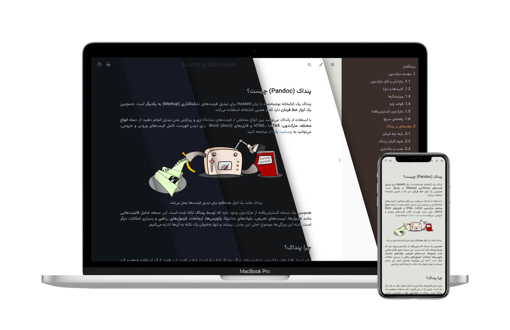

<div align="center">

# Learning Markdown

🌎 README available in: [English](README.md) | [فارسی](README.fa.md)

A comprehensive and practical guide to Markdown in Persian — built with _mdBook_.  
 This project is a structured guide to understanding Markdown, its use cases, and tools.

[][ci]&nbsp;
[][license]&nbsp;
[][Last Commit]&nbsp;

[**Live Demo** →][demo]
[][demo]

</div>

## 📑 Table of Contents

#### Markdown

- **Markup & Markdown**  
   What markup languages are and how Markdown became the go-to for documentation.
- **Use Cases of Markdown**  
   From documentation and note-taking to blogging and beyond that.
- **Editors**  
   An overview of recommended editors across different platforms.
- **Markdown ‌Basics**  
   Explore syntax, tips, and best practices.
- **Markdown Extended**  
   Variations of Markdown like GitHub Flavored Markdown (GFM) and how they extend the original syntax.
- **Markdown Cheatsheet**  
   A quick reference guide with essential syntax and formatting rules.

#### Pandoc

- **Getting to Know Pandoc**  
   Learn what Pandoc is, and why it's a powerful tool for converting documents between formats.
- **Command Line Interface (CLI)**  
   Understand what the command line is, how it differs from graphical interfaces (GUI), and why it’s essential for working with Pandoc.
- **How Pandoc Works**  
   Learn how Pandoc reads a document, processes it, and outputs it in the desired format.
- **Installation & Setup**  
   Step-by-step guide to installing Pandoc and preparing your environment.
- **Basic Conversions**  
   Explore how to transform Markdown into HTML, LaTeX, or PDF, and adjust settings to fit your needs.
- **Predefined Settings**  
   See how to store common options in YAML files to reuse them easily and keep commands clean.

## 📚 How to Read

- **Online:** Accessible on [GitHub Pages](https://ackreq.github.io/mdlrean).
- **Offline:** Build and serve the book locally (see instructions below).

## 🛠️ Build Locally

```sh
# Install mdBook:
cargo install mdbook mdbook-admonish

# Clone the repository:
git clone --depth=1 https://github.com/ackreq/mdlearn.git

# Navigate into the project and serve the book:
cd mdlearn
mdbook serve --open
```

## 🌱 Contributing

mdlearn is an open project, and I welcome feedback and contributions. If you find errors, have suggestions, or want to contribute additional content, feel free to open a pull request or submit an issue.

## 📜 Attribution & Licensing

This project includes content adapted from [_The Markdown Guide_ by Matt Cone](https://www.markdownguide.org/), licensed under [CC BY-SA 4.0](https://creativecommons.org/licenses/by-sa/4.0/).

All original content in this project is also shared under the same [CC BY-SA 4.0](https://creativecommons.org/licenses/by-sa/4.0/) license.

[ci]: https://github.com/ackreq/mdlearn/actions/workflows/mdbook.yml?query=event%3Apush+branch%3Amain
[license]: https://github.com/ackreq/mdlearn/blob/main/LICENSE
[demo]: https://ackreq.github.io/mdlearn
[Last Commit]: https://github.com/ackreq/mdlearn/commits/main
