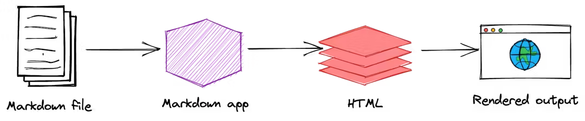

## ویرایشگرها

برای نوشتن و استفاده از مارک‌دون، ابتدا به یک ویرایشگر مناسب است. گرچه ویرایشگرهای زیادی برای همه پلتفرم‌ها وجود دارد، پشتیبانی از زبان فارسی (راست‌به‌چپ) محدود است و همین انتخاب‌ها را کمتر و تصمیم‌گیری را دشوارتر می‌کند.

ویرایشگرهای پیشنهادی برای هر پلتفرم:

- **💻 دسکتاپ (ویندوز، مک و لینوکس)**

  - [Obsidian](https://obsidian.md/) (پیشنهادی)
  - [MarkText](https://github.com/marktext/marktext)
  - [Anytype](https://anytype.io/)
  - [Ghostwriter](https://ghostwriter.kde.org/)

- **📱 موبایل**

  - [Markor](https://github.com/gsantner/markor) (اندروید)
  - [Obsidian](https://obsidian.md/) (اندروید/iOS)
  - [Simplenote](https://simplenote.com)

- **🌐 وب**

  - [Simplenote](https://simplenote.com) (پیشنهادی)
  - [StackEdit](https://stackedit.io/)

```admonish success title="نکاتی درمورد ویرایشگر Obsidian"
Obsidian تنها یک ویرایشگر ساده متن نیست؛ این برنامه امکاناتی فراهم می‌کند که نگارش و مدیریت یادداشت‌ها را بسیار کارآمد می‌کند. برخی از مهم‌ترین ویژگی‌های آن عبارت‌اند از:

- **پشتیبانی کامل از زبان فارسی و تشخیص خودکار جهت متن:** بدون نیاز به تنظیم دستی، متن‌های فارسی به‌درستی راست‌به‌چپ و متن‌های انگلیسی چپ‌به‌راست نمایش داده می‌شوند.
- **سیستم مدیریت دانش (KMS):** امکان لینک دادن یادداشت‌ها به یکدیگر و ایجاد شبکه‌ای از اطلاعات مرتبط، باعث می‌شود ایده‌ها و دانش شما منظم و قابل پیگیری باشند.
- **همگام‌سازی بین دستگاه‌ها و دسترسی آفلاین:** می‌توانید یادداشت‌هایتان را بین کامپیوتر، موبایل و تبلت همگام‌سازی کنید و بدون نیاز به اینترنت دائم شروع به نوشتن کنید.
- **پشتیبانی از LaTeX:** نوشتن فرمول‌های ریاضی و محاسبات علمی در یادداشت‌ها بسیار ساده و راحت است.
```

## نحوه کارکرد

متن مارک‌دون در یک فایل با پسوند `.md` یا `.markdown` ذخیره می‌شود. سپس برنامه‌های مارک‌دون از چیزی به نام پردازشگر مارک‌دون (Markdown processor) استفاده می‌کنند که گاهی به آن «پارسر» هم گفته می‌شود تا متن شما را به فرمت‌های قابل نمایش مانند HTML یا PDF تبدیل کنند. در این مرحله، سند شما قابل مشاهده در مرورگر وب یا آماده چاپ کردن است.

تصویر زیر این روند را نشان میدهد:

<div style="text-align: center;">
  
</div>

خلاصه روند در چهار مرحله تقسیم می‌شود:

1. ایجاد یک فایل مارک‌دون با پسوند `.md` یا `.markdown` در یک ویرایشگر.
2. این فایل را در برنامه مارک‌دون باز کنید و شروع به نوشتن کنید.
3. برنامه مارک‌دون، فایل شما را به یک صفحه HTML تبدیل می‌کند.
4. می‌توانید صفحه HTML را در مرورگر ببینید یا آن را به فرمت‌های دیگری مثل PDF تبدیل کنید.

```admonish warning title="نکته"
ممکن است با توجه به برنامه‌ای مورد استفاده، نحوه انجام این مراحل کمی متفاوت باشد، اما کلیت روند همین است.
```
