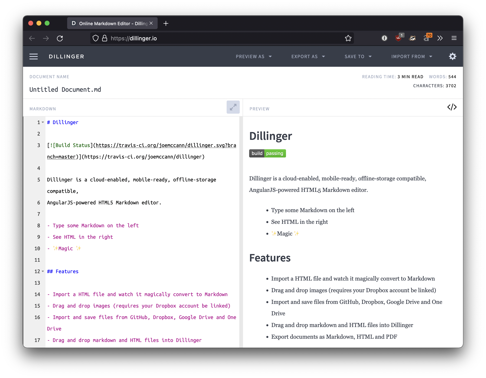

## مقدمه

مارک‌دون (**Markdown**) یک زبان نشانه‌گذاری (Markup) سبک است که با آن می‌توان به متون ساده، قالب‌بندی و ساختار اضافه کرد. این زبان در سال ۲۰۰۴ توسط **جان گروبر** طراحی شد و امروز یکی از محبوب‌ترین زبان‌های نشانه‌گذاری در جهان است.

کار با مارک‌دون با استفاده از ویرایشگرهای گرافیکی (**WYSIWYG**: آنچه می‌بینی همان است که دریافت می‌کنی) مثل _Microsoft Word_ فرق دارد. در Word، شما بر روی دکمه‌ها کلیک می‌کنید و فوراً نتیجه قالب‌بندی را روی متن می‌بینید. اما مارک‌دون این‌گونه نیست؛ در مارک‌دون شما نشانه‌ها و دستورهایی را در متن اضافه می‌کنید تا مشخص شود کدام قسمت‌ها باید به شکل متفاوت نمایش داده شوند، و این قالب‌بندی بعداً هنگام نمایش یا خروجی گرفتن اعمال می‌شود.

به‌عنوان مثال، تصویر زیر بخشی از یک کد مارک‌دون را نشان می‌دهد؛ کد در سمت چپ و پیش‌نمایش آن در سمت راست قرار دارد:

<div style="text-align: center;">
  
</div>

```admonish note title="نکته"
مارک‌دون یک «فرمت نوشتاری» (Writing Format) است، نه یک «فرمت انتشار» (Publishing Format) مانند PDF. این یعنی شما متن را در قالبی ساده و قابل‌خواندن می‌نویسید، و سپس می‌توانید آن را به فرمت‌های گوناگون برای انتشار تبدیل کنید.
```

گاهاً معیار برای یک ابزار نوشتار خوب این است که استفاده از آن به یک عادت تبدیل شود؛ نوشتن با آن باید روان و بدون دردسر باشد. اگر احساس کنیم ابزار جلوی کارمان را می‌گیرد، دیگر از آن استفاده نمی‌کنیم.

یکی از دلایل موفقیت مارک‌دون در برابر دیگر زبان‌های نشانه‌گذاری، ایجاد تعادل درست بین **سهولت** و **کارایی** است. یادگیری آن آسان و استفاده از آن سریع است، برخلاف زبان‌هایی مثل LaTeX که پیچیدگی بیشتری دارند. . همچنین بعضی از مبدل‌های مارک‌داون می‌توانند از زبان LaTeX نیز پشتیبانی کنند.

از زمان معرفی مارک‌دون در سال ۲۰۰۴، میلیون‌ها نفر از آن برای نوشتن تقریبا همه‌چیز استفاده کرده‌اند؛ از یادداشت‌های روزانه گرفته تا مستندات رسمی. مارک‌دون همه‌جا حضور دارد و در فصل «کاربردها و مزایا» خواهید دید که تا چه اندازه گسترده استفاده می‌شود.

دانستن مارک‌دون در بسیاری از شغل‌ها به یک مهارت ضروری تبدیل شده است، به‌خصوص در حوزه‌ی فناوری که نوشتن مستندات برای ابزار یا نرم‌افزاری که ساخته‌اید بخش جدایی‌ناپذیر کار است.

در ادامه، ابتدا با مفاهیم پایه و نسخه اصلی مارک‌دون آشنا می‌شوید، سپس به سراغ انواع «مشتقات» و گونه‌های آن مانند GitHub Flavored Markdown می‌رویم. همچنین، ابزارها و مبدل‌هایی مانند Pandoc را بررسی می‌کنیم و یاد می‌گیریم چگونه از مارک‌دون همراه با LaTeX برای نوشتن متون علمی و ریاضی استفاده کنیم.
