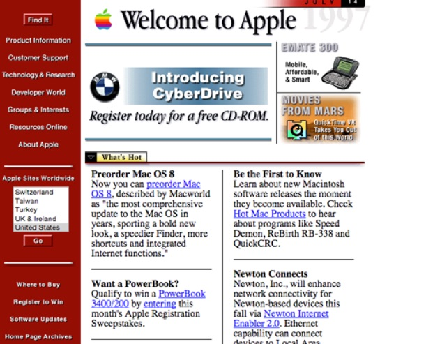

## آشنایی با زبان‌های مارک‌آپ

یک **زبان مارک‌آپ** زبانی است که برای _تعریف ساختار_ و _نمایش متن_ طراحی شده است.

واژه‌ی «مارک‌آپ» (markup) برگرفته از عبارت «علامت‌گذاری روی نسخه‌های کاغذی» (marking up) است؛ به معنای دستورالعمل‌ها و اصلاحاتی که ویراستاران روی نسخه‌های دست‌نویس نویسندگان اعمال می‌کنند، یا زمانی که خواننده بخشی از متن را برجسته و نشانه‌گذاری (هایلایت) می‌کند.

برای مثال، **HTML** یا _HyperText Markup Language_ یکی از شناخته‌شده‌ترین زبان‌های مارک‌آپ است. در یک فایل متنی مانند فایل HTML، اجزای محتوا با استفاده از «تگ»ها نشانه‌گذاری می‌شوند. این تگ‌ها هدف و نقش آن بخش از محتوا را مشخص می‌کنند:

```html
<!DOCTYPE html>
<html>
  <head>
    <title>HTML Example Code</title>
  </head>

  <body>
    <h1>Learning and Practicing</h1>
    <p>Markdown made writing simple.</p>
  </body>
</html>
```

در مثال بالا:

- `<h1>` نشان می‌دهد که «Learning and Practicing» یک تیتر اصلی (Heading Level 1) است.
- `<p>` مشخص می‌کند که متن داخل آن یک پاراگراف است.

نمونه‌های مشهور دیگری از زبان‌های مارک‌آپ عبارت‌اند از:

- **LaTeX**: برای پردازش اسناد علمی و ریاضی
- **XML**: برای ذخیره‌سازی و تبادل داده
- **Markdown**: برای نوشتن مستندات و متن‌های ساده با قالب‌بندی

برخلاف زبان‌های برنامه‌نویسی که به سیستم دستورالعمل می‌دهند، زبان‌های مارک‌آپ بیشتر به _توصیف و سازمان‌دهی محتوا_ می‌پردازند.

زبان نشانه‌گذاری سبک (Lightweight Markup Language) که گاهی به آن زبان نشانه‌گذاری ساده هم گفته می‌شود، زبانی است با نگارشی ساده و ظریف. این زبان به‌گونه‌ای طراحی شده است که نوشتن آن با هر ویرایشگر متنی معمولی آسان باشد و خواندن متن خام آن نیز ساده باشد. زبان‌های نشانه‌گذاری سبک در کاربردهایی استفاده می‌شوند که ممکن است لازم باشد هم متن خام سند خوانده شود و هم خروجی نهایی و رندر شده آن. مارک‌‌دون یک نمونه از آن است.

## پیدایش مارک‌دون

زبان مارک‌دون در سال ۲۰۰۴ با همکاری آرون شوارتز، که در طراحی قواعد آن نقش داشت، خلق شد. هدف اصلی مارک‌دون ساده‌سازی نوشتن متن‌های قالب‌بندی‌شده بود، به‌گونه‌ای که متن خام به‌راحتی قابل خواندن باشد و در صورت نیاز به XHTML یا HTML معتبر شود.

در سال ۲۰۰۶ گروبر اولین نسخه Markdown را به عنوان یک پروژه منبع باز منتشر کرد و به دیگران اجازه داد تا در توسعه آن مشارکت کنند.

بر خلاف زبان‌های نشانه‌گذاری پیچیده مانند HTML یا Rich Text Format، مارک‌دون طوری طراحی شده که متن نوشته‌شده در حالت خام هم خوانا و طبیعی به نظر برسد، بدون آنکه پر از تگ‌ها و دستورهای قالب‌بندی باشد.

ایده‌ی مارک‌دون از سبک ساده و خوانای ایمیل‌های متنی الهام گرفته شده است.

در اوایل دهه ۲۰۰۰، نوشتن برای وب کار دشواری بود؛ وبلاگ‌ها تازه شکل گرفته بودند و پلتفرم‌های بلاگ‌نویسی امکانات محدودی داشتند. برای ایجاد محتوای قابل قبول، اغلب مجبور بودید HTML را فرا بگیرید.

برای مثال، وب‌سایت شرکت اپل در سال ۱۹۹۷ چنین شکلی داشت:

<div style="text-align: center;">
  
  <figcaption style="font-size: 15px">💡 طراحی وب‌سایت‌ها در آن زمان پیچیده و کمتر کاربرپسند بود، و نیاز به دانش فنی بیشتری داشت</figcaption>
</div>

گروبر با هدف بازگرداندن فرآیند نوشتن اسناد دیجیتال به دست نویسندگان، به جای برنامه‌نویسان، مارک‌دون را طراحی کرد تا همه بتوانند به راحتی بنویسند و متون زیبا تولید کنند.
