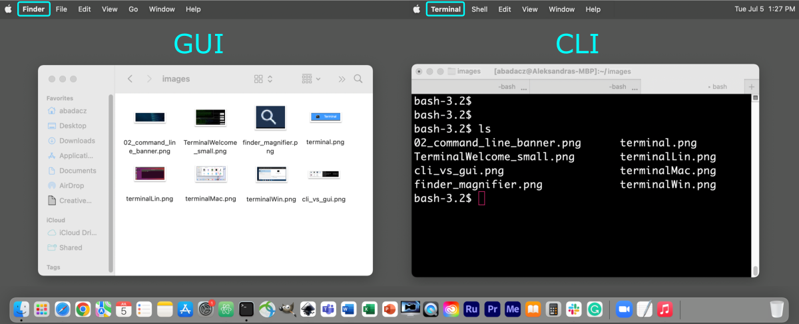
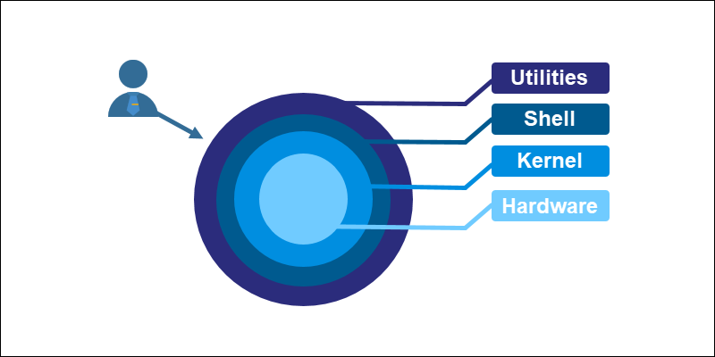

## رابط خط فرمان چیست؟

رابط خط فرمان **(Command Line Interface – CLI)** یک رابط متنی است که در آن کاربر با وارد کردن دستورات، با سیستم‌عامل کامپیوتر تعامل می‌کند. برخلاف **رابط‌های کاربری گرافیکی (GUI)** که بر پایه آیکن‌ها و منوها هستند، در CLI همه‌چیز بر پایه تایپ دستور انجام می‌شود. این روش امکان کنترل دقیق و بهتر سیستم را به کاربر می‌دهد.

```admonish quote title="نقل قول"
رابط‌های کاربری گرافیکی انجام کارهای ساده را آسان می‌کنند، در حالی که رابط‌های خط فرمان انجام کارهای دشوار را امکان‌پذیر می‌سازند.
```

به عنوان مثال در محیط گرافیکی، برای باز کردن یک فایل بر روی آیکن آن دوبار کلیک می‌کنید؛ در خط فرمان همان کار را با نوشتن یک دستور انجام می‌دهید:

```sh
open myfile.txt
```

خروجی دستور در **ترمینال** نمایش داده می‌شود یا فایل با برنامه مربوطه باز می‌شود.

برای کار با خط فرمان، ابتدا باید محیطی داشته باشیم که دستورات در آن اجرا شوند. **ترمینال** این امکان را برای ما فراهم می‌کند. ترمینال یک برنامه یا اپلیکیشن است که محیط لازم برای دسترسی به خط فرمان را فراهم می‌کند. در واقع همان پنجره یا فضایی است که آن را باز می‌کنید تا دستورات را تایپ کنید. به این ترتیب، ترمینال نقش **پل ارتباطی بین کاربر و سیستم‌عامل** را ایفا می‌کند: شما دستور می‌دهید، سیستم آن را اجرا می‌کند و نتیجه را مشاهده می‌کنید:

<div style="text-align: center;">
  
  <figcaption style="font-size: 15px">
    تصویر مربوط به سیستم عامل مک است؛ پنجره سمت راست ترمینال و پنجره سمت چپ یک برنامه با محیط گرافیکی را نشان می‌دهد.
  </figcaption>
</div>

در **ویندوز**، ترمینال‌های رایج شامل _Command Prompt_ و _PowerShell_ هستند. در **لینوکس** و **مک**، معمولاً برنامه‌ای به نام _Terminal_ وجود دارد که یک **نشست شِل (Shell Session)** را باز می‌کند. ترمینال این امکان را می‌دهد که با تایپ دستورات، با شل تعامل کنید و نتایج آن را مشاهده کنید.

**شل** برنامه‌ای است که دستورات واردشده در ترمینال را پردازش می‌کند و به‌عنوان واسطه‌ای بین کاربر و سیستم‌عامل عمل می‌کند. هر نسخه از شل قابلیت‌ها و دستورات متفاوتی ارائه می‌دهد. شل علاوه بر تفسیر و اجرای دستورات، **متغیرهای محیطی** را مدیریت می‌کند، از **اسکریپت‌نویسی** پشتیبانی می‌کند و امکاناتی مانند **تاریخچه دستورات** و **اتصال خروجی یک دستور به ورودی دستور دیگر (Piping)** را در اختیار کاربر قرار می‌دهد.

روند کلی به شکل زیر است:

- یک **ترمینال** (یا کنسول) باز می‌کنید تا به **خط فرمان (CLI)** دسترسی پیدا کنید.
- ترمینال یک نشست **شل** را ایجاد می‌کند.
- شل دستورات تایپ‌شده شما را تفسیر کرده و با سیستم‌عامل تعامل می‌کند تا آن‌ها را اجرا کند.
- نتایج یا بازخورد دستورات در پنجره ترمینال نمایش داده می‌شوند.

<div style="text-align: center;">
  
  <figcaption style="font-size: 15px">
    نحوه ارتباط بین لایه‌های مختلف سیستم‌عامل شامل تعامل بین سخت‌افزار، هسته، شل و برنامه‌های کاربر.
  </figcaption>
</div>

## شروع کار با خط فرمان

برای استفاده از خط فرمان، ابتدا باید ترمینال سیستم‌عامل خود را باز کنید. هر سیستم‌عاملی روش‌های ساده‌ای برای دسترسی به برنامه ترمینال ارائه می‌دهد.

- **ویندوز (Windows)**

  برای باز کردن ترمینال، کلید **Windows** یا **Ctrl + Esc** را فشار دهید تا منوی Start باز شود، سپس برنامه "Command Prompt" یا "PowerShell" را جست‌وجو و اجرا کنید.
  راه میانبر دیگر **Windows + X** است که منوی دسترسی سریع را باز می‌کند و می‌توانید Command Prompt یا PowerShell را انتخاب کنید.

- **مک (macOS)**

  برای باز کردن ترمینال، از **Spotlight Search** استفاده کنید: کلیدهای **Command (⌘) + Spacebar** را فشار دهید، "Terminal" را تایپ کرده و Enter بزنید.
  همچنین می‌توانید ترمینال را در پوشه **Utilities** داخل Applications پیدا کنید.

- **لینوکس (Linux)**

  روش باز کردن ترمینال بسته به توزیع متفاوت است، اما معمولاً می‌توانید با فشار دادن **Ctrl + Alt + T** ترمینال را باز کنید.
  همچنین ترمینال معمولاً در منوی برنامه‌ها با نام "Terminal" یا "Console" قابل پیدا کردن است.

## جا‌به‌جایی در ترمینال

وقتی ترمینال را باز می‌کنید، معمولاً متنی روی صفحه ظاهر می‌شود که به آن **پرامپت شل (Shell Prompt)** گفته می‌شود. این نشانه به کاربر اعلام می‌کند که شل آماده دریافت دستورات است. شکل پرامپت بسته به سیستم‌عامل و نوع شل متفاوت است:

- **لینوکس و مک:**

  ```sh
  [me@devbox ~]$
  ```

  - `me`: نام کاربری
  - `devbox`: نام سیستم (hostname)
  - `~`: مسیر دایرکتوری یا پوشه جاری

- **ویندوز (Windows – Command Prompt):**

  ```bat
  C:\Users\me>
  ```

  - `C:` درایو جاری
  - `Users\me` مسیر دایرکتوری یا پوشه جاری

- **ویندوز (PowerShell):**

  ```powershell
  PS C:\Users\me>
  ```

با وجود تفاوت‌های ظاهری، مفهوم اصلی در همه‌ی این پرامپت‌ها یکسان است: نشان دادن موقعیت فعلی کاربر در سیستم فایل و آمادگی شل برای دریافت دستور.

#### دایرکتوری جاری (Current Working Directory)

در هر لحظه، کاربر درون یک پوشه یا داریکتوری مشخص قرار دارد که به آن **دایرکتوری جاری** گفته می‌شود. این دایرکتوری می‌تواند شامل فایل‌ها و زیرپوشه‌های دیگر باشد و خود نیز زیرمجموعه یک دایرکتوری بالاتر (**Parent Directory**) باشد.

برای مشاهده مسیر کامل دایرکتوری جاری از دستورات زیر استفاده می‌شود:

- در لینوکس و مک:

  ```sh
  pwd
  ```

- در ویندوز:

  ```bat
  echo %cd%
  ```

برای نمایش فایل‌ها و پوشه‌های موجود در دایرکتوری جاری:

- در لینوکس و مک:

  ```sh
  ls
  ```

- در ویندوز:

  ```bat
  dir
  ```

#### مسیر مطلق و نسبی

برای اشاره به مسیر یک فایل یا پوشه، دو روش اصلی وجود دارد:

- **مسیر مطلق (Absolute Path):** مسیر کامل که از ریشه سیستم فایل آغاز می‌شود.
  مثال:

  ```sh
  /home/me/Documents/file.txt     # Linux/mac
  C:\Users\Me\Documents\file.txt  # Windows
  ```

- **مسیر نسبی (Relative Path):** مسیری که نسبت به دایرکتوری جاری محاسبه می‌شود.
  مثال: اگر در مسیر `/home/me` قرار داشته باشیم:

  ```sh
  Documents/file.txt  # /home/me/Documents/file.txt معادل
  ```

#### تغییر دایرکتوری (cd)

برای جابه‌جایی بین پوشه‌ها از دستور **cd** استفاده می‌شود. این دستور می‌تواند هم با **مسیر نسبی** و هم با **مسیر مطلق** مورد استفاده قرار گیرد:

- ورود به یک پوشه (با مسیر نسبی):

  ```sh
  cd Documents
  ```

- ورود به یک پوشه (با مسیر مطلق):

  ```sh
  cd /home/me/Documents    # Linux/mac
  cd C:\Users\Me\Documents # Windows
  ```

- بازگشت به پوشه والد (یک سطح بالاتر):

  ```sh
  cd ..
  ```

- بازگشت به دایرکتوری خانه کاربر:

  ```sh
  cd ~            # Linux/mac
  cd %HOMEPATH%   # Windows
  ```

به این ترتیب، بسته به موقعیت فعلی شما در سیستم فایل، می‌توان با استفاده از مسیرهای نسبی به‌سادگی بین پوشه‌ها حرکت کرد یا با مسیرهای مطلق مستقیماً به یک مقصد مشخص رفت.

```admonish tip title="نکته"
یادگیری نحوه استفاده از ترمینال و جا‌به‌جایی بین پوشه‌ها، **پایه تمام کارهای دیگر در خط فرمان** را تشکیل می‌دهد. وقتی در این کار مراحل مهارت پیدا کنید، استفاده از دستورات دیگر برای مدیریت فایل‌ها یا اجرای برنامه‌ها به مرور طبیعی‌تر خواهد شد.

در نگاه اول، نوشتن دستور در ترمینال ممکن است کمی ناآشنا باشد. اما برای استفاده از **پنداک**، آشنایی نسبی با محیط خط فرمان ضروری است؛ زیرا این ابزار بیشتر از طریق ترمینال اجرا می‌شود و بسیاری از امکانات پیشرفته آن تنها از همین طریق در دسترس هستند.
```
