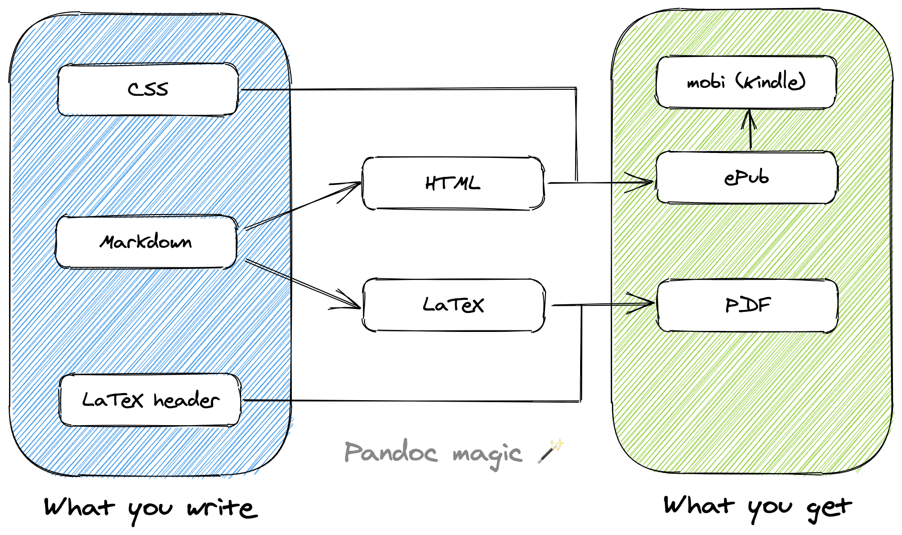
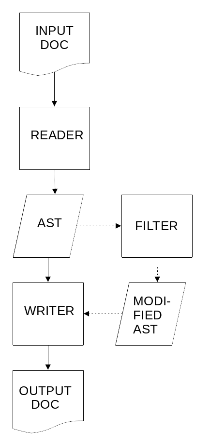
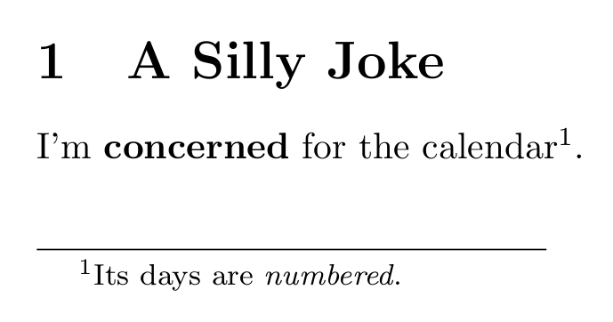

## پنداک (Pandoc) چیست؟

پنداک یک کتابخانه نوشته‌شده با زبان **Haskell** برای **تبدیل فرمت‌های نشانه‌گذاری (Markup) به یکدیگر** است. همچنین یک **ابزار خط فرمان** دارد که از همین کتابخانه استفاده می‌کند.

با استفاده از پانداک می‌توانید بین انواع مختلفی از فرمت‌های نشانه‌گذاری و پردازش متن تبدیل انجام دهید؛ از جمله **انواع مختلف مارک‌دون، HTML، LaTeX و فایل‌های Word (docx)**.
برای دیدن فهرست کامل فرمت‌های ورودی و خروجی، می‌توانید به [وبسایت پانداک](https://pandoc.org/diagram.svgz) مراجعه کنید.

<div style="text-align: center;">
  
  <figcaption style="font-size: 15px">
    پنداک مانند یک <strong>ابزار همه‌کاره</strong> برای تبدیل فرمت‌ها عمل می‌کند.
  </figcaption>
</div>

همچنین یک نسخه گسترش‌یافته از مارک‌دون وجود دارد که توسط **پنداک** ارائه شده است. این نسخه شامل قابلیت‌هایی مانند **جدول‌ها، لیست‌های تعریفی، بلوک‌های متادیتا، پانویس‌ها، ارجاعات، فرمول‌های ریاضی** و بسیاری امکانات دیگر است.
البته این ویژگی‌ها موضوع اصلی این بخش نیستند و تنها به‌عنوان یک نکته‌ به آن‌ها اشاره می‌کنیم.

## چرا پنداک؟

برای تبدیل فایل‌های مارک‌دون به فرمت‌های دیگر، به یک ابزار نیاز است. ابزاری که در این فصل از آن استفاده خواهیم کرد **پنداک** است. پنداک از **مارک‌دون پایه** و همچنین چندین **افزونه‌ی گسترش‌یافته** پشتیبانی می‌کند. علاوه بر این، امکان تعریف **قالب‌ها (Templates)** و **استایل‌ها (Stylesheets)** را فراهم می‌کند تا خروجی فایل‌ها را مطابق نیاز خود شخصی‌سازی کنید:

<div style="text-align: center;">
  
</div>

پنداک تنها برای تبدیل مارک‌دون به فرمت‌های خروجی مختلف نیست؛ بلکه می‌تواند بین **انواع فرمت‌های متفاوت** ورودی و خروجی تبدیل انجام دهد. با این حال، در این کتاب تنها به **تبدیل مارک‌دون به فرمت‌های دیگر** می‌پردازیم.

از آنجا که مارک‌دون فقط یک زبان برای ایجاد ساختار در متن است، به ابزار خاصی وابسته نیست. بنابراین می‌توان از هر نرم‌افزار یا ویرایشگری که آن را پشتیبانی می‌کند برای پردازش اسناد استفاده کرد. اگر ویرایشگر شما امکان خروجی گرفتن در فرمت‌ها و استایل‌های مختلف را داشته باشد، این ساده‌ترین روش برای خروجی گرفتن از متون مارک‌دون خواهد بود.

اما با استفاده از پنداک، کنترل و انعطاف بسیار بیشتری روی نحوه‌ی پردازش اسناد خواهید داشت. پنداک به‌مراتب **قدرتمندتر و همه‌کاره‌تر** از هر ویرایشگر دیگری است که مارک‌دون را پشتیبانی می‌کند.

وقتی کار نوشتن جدی‌تر می‌شود و می‌خواهید بر شکل و ظاهر نهایی اسناد **کنترل کامل** داشته باشید، به توانمندی‌های پنداک نیاز است. البته یادگیری آن می‌تواند کمی دشوار باشد، اما اگر ابتدا با مثال‌ها و موارد ساده شروع شود، به‌تدریج با این ابزار آشنا خواهید شد و پایه‌ای محکم برای استفاده از ویژگی‌های پیشرفته‌تر خواهید داشت.

## نحوه‌ی کارکرد پنداک

[^1]: مطالب این بخش (نحوه کارکرد پنداک) از وبسایت [chulsky](http://chulsky.com/pandoc/) است. برای جزئیات دقیق‌تر، می‌توانید به وبسایت مراجعه کنید.

پنداک تمام اسناد را به یک **درخت نحو انتزاعی** یا Abstract Syntax Tree (AST) تبدیل می‌کند[^1]. از این نقطه، محتوا می‌تواند **فیلتر شود** و اسناد در هر فرمت دلخواهی نوشته شوند:

<div style="text-align: center;">
  
</div>

برای درک بهتر نحوه‌ی کار AST، ساده‌ترین روش این است که یک نمونه را مشاهده کنیم. فرض کنید سندی به شکل زیر داریم:

<div style="text-align: center;">
  
</div>

اگر این سند به‌عنوان مثال در **LaTeX** نوشته شده باشد (پنداک بر این اصل بنا شده است که زبان فایل ورودی محدودیتی ایجاد نکند)، دستور زیر AST آن را تولید می‌کند:

```sh
pandoc --from=latex --to=native silly.tex
```

و خروجی به این شکل خواهد بود:

```ast
[ Header
    1
    ( "a-silly-joke" , [] , [] )
    [ Str "A" , Space , Str "Silly" , Space , Str "Joke" ]
, Para
    [ Str "I\8217m"
    , Space
    , Span ( "" , [] , [] ) [ Strong [ Str "concerned" ] ]
    , Space
    , Str "for"
    , Space
    , Str "the"
    , Space
    , Str "calendar"
    , Note
        [ Para
            [ Str "Its"
            , Space
            , Str "days"
            , Space
            , Str "are"
            , Space
            , Span ( "" , [] , [] ) [ Emph [ Str "numbered" ] ]
            , Str "."
            ]
        ]
    , Str "."
    ]
]
```

در خط ۱، Header constructor را داریم که یک **عنوان سطح ۱** است (خط ۲) و به آن یک نام اختصاص داده شده (خط ۳) و همچنین متن آن (خط ۴). توجه داشته باشید که متن شامل سازنده‌های **Str** است—یک رشته جداگانه برای هر کلمه—و بین آن‌ها سازنده‌های **Space** قرار دارند برای مشخص کردن فاصله بین کلمات.

سپس Para constructor برای یک پاراگراف در خط ۵ آمده است. داخل پاراگراف، اولین رشته `"I'm"` شامل یک **علامت کوتاه‌کننده (آپاستروف)** است. پنداک به‌طور خودکار **نقل‌قول‌ها و آپاستروف‌ها** را با سمبل‌های مناسب [UTF-8](https://fa.wikipedia.org/wiki/%DB%8C%D9%88%D8%AA%DB%8C%E2%80%8C%D8%A7%D9%81-%DB%B8) قرار می‌دهد. عدد 8217 مقدار [دسیمال یا ده‌دهی](https://fa.wikipedia.org/wiki/%D8%AF%D9%87%E2%80%8C%D8%AF%D9%87%DB%8C) کد UTF-8 این نماد است. بقیه کد نیز به همین صورت ادامه می‌یابد؛ برای درک اولیه و کوتاه از نحوه کارکرد پنداک، همین مقدار کافی است.

چون نمایش میانی سند یا همان AST در پنداک نسبت به بسیاری از فرمت‌هایی که بین آن‌ها تبدیل انجام می‌دهد، **کم‌جزئیات‌تر و ساده‌تر** است، نباید انتظار تبدیل کامل و دقیق بین همه فرمت‌ها را داشت. پنداک سعی می‌کند **عناصر ساختاری سند** را حفظ کند، اما جزئیاتی مانند اندازه حاشیه (Margin) را تضمین نمی‌کند. همچنین برخی عناصر سند، مانند جدول‌های پیچیده، ممکن است با مدل ساده پنداک سازگار نباشند. در حالی که تبدیل از مارک‌دون به فرمت‌های دیگر معمولاً کامل است، تبدیل از فرمت‌های پیچیده‌تر ممکن است منجر به از دست رفتن برخی جزئیات شود.
